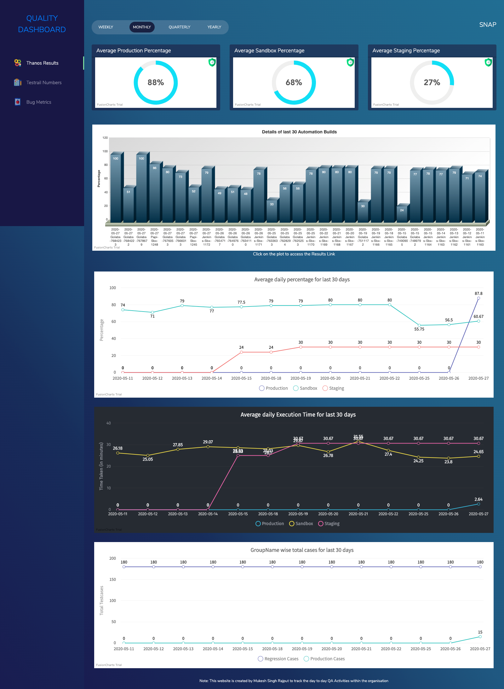

# automationDashboard
To Start Web Server - `php -S localhost:8282`

# Examples

###Home Page of QA Dashboard

###Automation Result Numbers for all the Projects

###Automation Result Numbers for One Project

###Testrail Numbers Page for all the Projects

###Testrail Numbers Page for one Project

###Bug Metrics Page for all the Projects

###Bug Metrics Page for one Project

