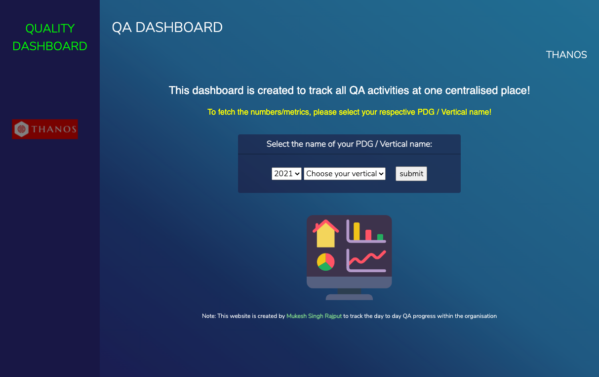
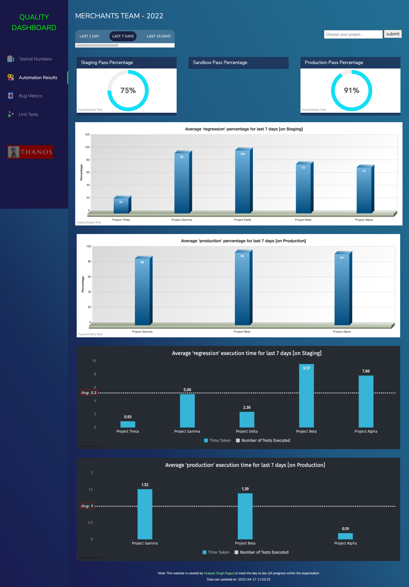
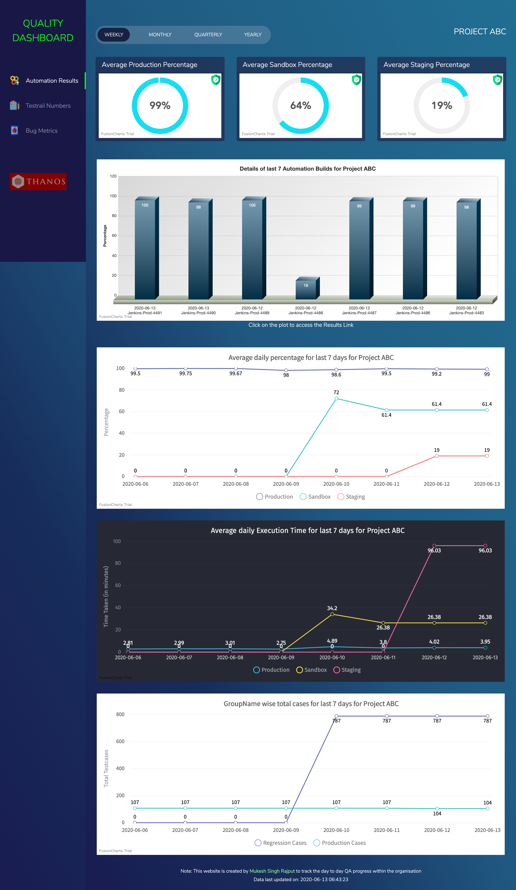
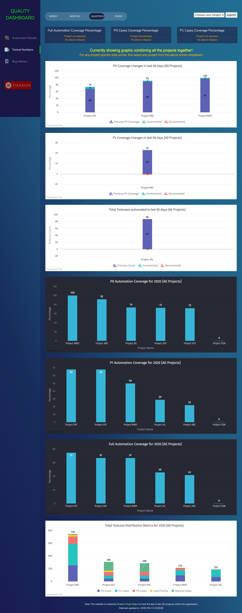
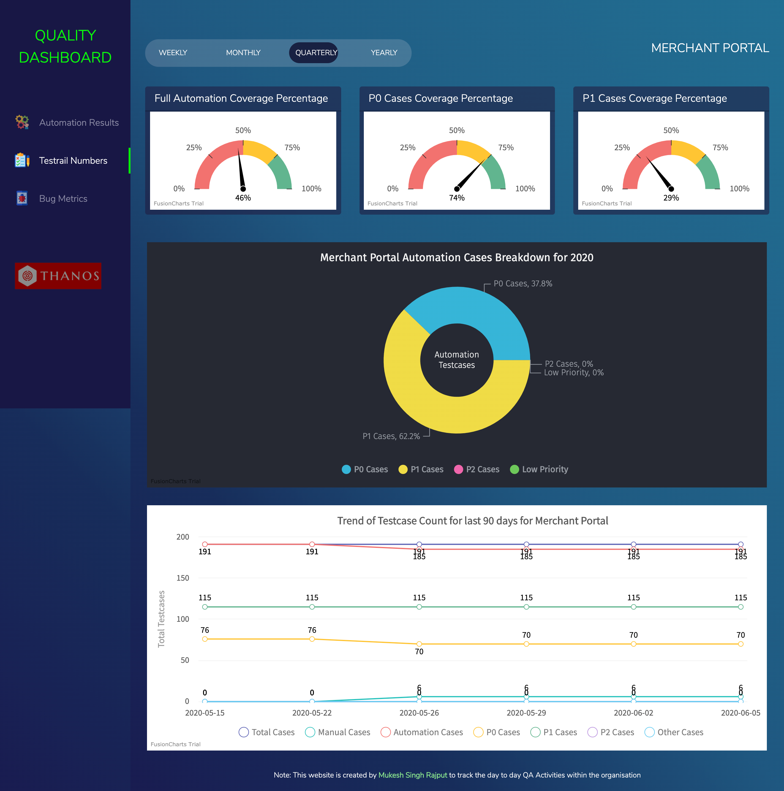
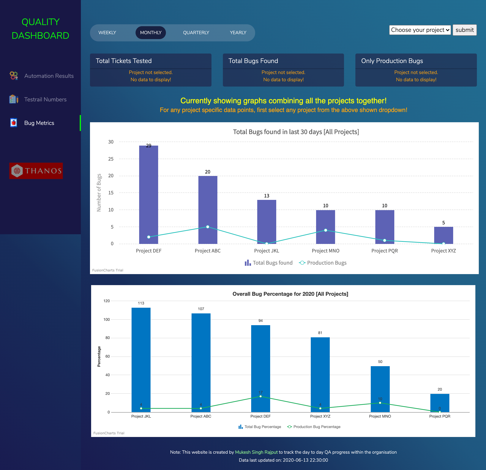
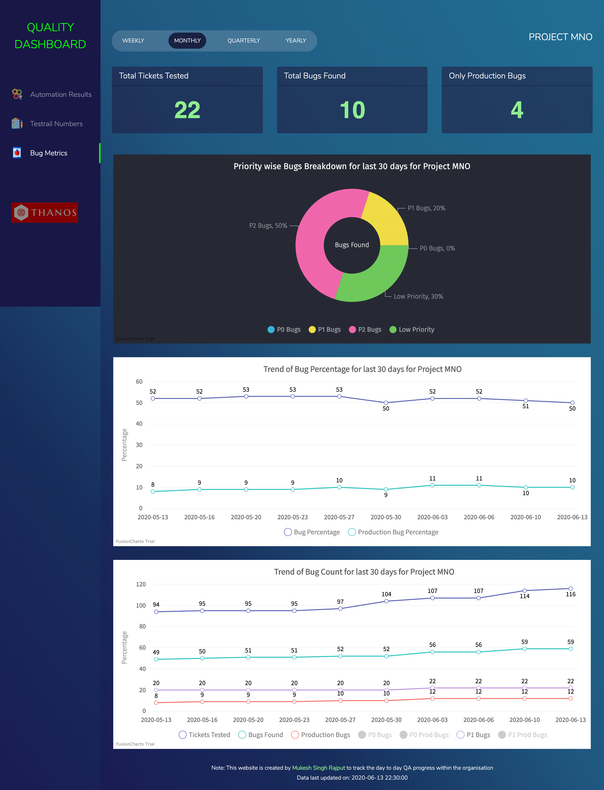

# QUALITY DASHBOARD

## Prerequisites

#### 1. Install php server in your machine
If its Mac, php server comes installed by default, just run this cmd to start server: `php -S localhost:8282`

#### 2. Install mysql server
And then start the server using: `mysql.server start`

#### 3. Setup Database and tables
Use [this basic mysql dump file](server/mysql-dump.sql "mysql-dump.sql") to create database and insert few dummy entries, on successful execution of this script you should get 3 tables (results, jira, testrail) created inside db name as `thanos`

#### 4. Clone this repo in your machine
After cloning the repo, using terminal navigate to the downloaded folder path and start php server using `php -S localhost:8282`

## Start Server
Start the php server and navigate to `http://localhost:8282`, you should see the home page as shown in screenshots below.

## Screenshots

### Home Page of QA Dashboard:

### Automation Result Numbers for all the Projects:

### Automation Result Numbers for One Project:

### Testrail Numbers Page for all the Projects:

### Testrail Numbers Page for one Project:

### Bug Metrics Page for all the Projects:

### Bug Metrics Page for one Project:

## Debugging
Incase your mysql server is not able to execute some of the queries and showing error something like: 
`Error Code: 1055. Expression #2 of SELECT list is not in GROUP BY clause and contains nonaggregated column 'thanos.a.totalTicketsTested' which is not functionally dependent on columns in GROUP BY clause; this is incompatible with sql_mode=only_full_group_by`

 Then run this query in the mysql terminal or UI: `set global sql_mode='';` and start the sql connection again, please remember that if you restart the mysql server or your laptop then you might need to execute this cmd again.

## References:
This dashboard has been creating by using public services of [Fusion Charts](https://www.fusioncharts.com/).
A big Thanks to Fusion Charts team for putting such a wonderful documentation which helped me in swift integration.
