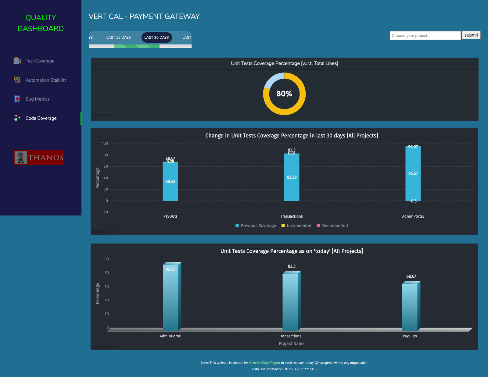
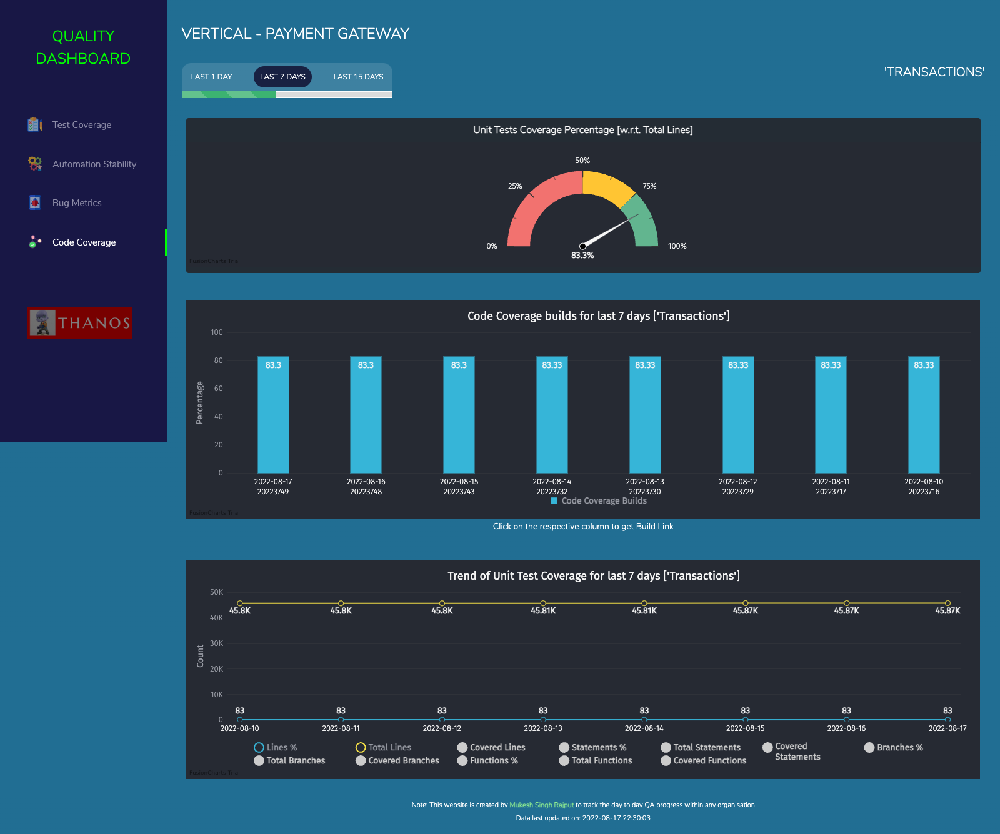

# QUALITY DASHBOARD
The purpose of creating this dashboard is to track the overall Quality Metrics of any product/service within any organization which has a lot of teams and so it's difficult to track each team manually.

### QA Dashboard can help to track:
1. Progress in terms of `Test Coverage` like how many total testcases we have, distribution in terms of priority like P0, P1, P2 etc, Automation coverage and many more

2. Progress report of `Automation Stability` and Execution time for each stream/project and other relevant trend charts around it

3. `Bugs Metrics` ie. data around total tickets tested, numbers of Bugs found in production or staging environment, what is their priority and other relevant trend charts around it

4. `Code Coverage` data is helpful to track the code coverage for developer's code via Unit Tests (written by devs). It supports not only Line Coverage but also Statement Coverage, Branch Coverage & Function Coverage (default is line coverage)

## Screenshots:

### Home Page of QA Dashboard:

### Test Coverage Data for all the Projects:

### Test Coverage Data for a selected Project:

### Automation Stability Data for all the Projects:

### Automation Stability Data for a selected Project:

### Bug Metrics Data for all the Projects:

### Bug Metrics Data for a selected Project:

### Code Coverage Data for all the Projects:

### Code Coverage Data for selected Project:

### Lets talk about some of the hidden features:
##### 1. Dark & Light Mode View:
To enable or disable the darkmode use query param as [`darkmode=1`](http://localhost:8282/testrail.php?darkmode=1) (by default its `darkmode=1`)
##### 2. Pod View for bigger teams:
In case your Group or Vertical is quite big then you can convert the dashboard to only show high-level data for bigger teams ie. pods (1 pod = 2 or more smaller teams). Use query param as [`podview=1`](http://localhost:8282/testrail.php?podview=1) (by default its `podview=0`)

**Note:** All query params get stored in **cookies** so that you don't need to pass them in URL every time, this means make sure to use `darkmode=1` or`podview=0` to turn off these views accordingly.

## Tools/Languages Used:
##### HTML
##### PHP
##### JavaScript
##### MYSQL

## Prerequisites:

#### 1. Install php server in your machine
If its Mac, php server comes installed by default, just run this cmd to start server: `php -S localhost:8282`

#### 2. Install mysql server
And then start the server using: `mysql.server start`

#### 3. Setup Database and tables
Use [this basic db dump file](utils/db-dump.sql "db-dump.sql") to create database and insert few dummy entries, on the successful execution of this script you should get minimum 4 tables (`<teamName>_results`, `<teamName>_jira`, `<teamName>_testrail`, `<teamName>_units`) created inside a database named as `thanos`

#### 4. Clone this repo in your machine
After cloning the repo, navigate to the `utils` folder and update database credentials in [this file](utils/constants.php "constants.php")

## Start Web Server:
Start the php server and navigate to `http://localhost:8282`, you should see the home page as shown in the screenshots above.

## How I am populating data in mysql tables:
1. For `<teamName>_results table` - I have updated my automation framework to insert required data in `results` table at the end of each automation execution.

2. For `<teamName>_testrail table` - Please don't be confused with the table name, it is not only limited to testrail numbers, but these numbers can also be fetched from any testcase management tool. I have used APIs of Testrail to fetch all the required numbers from Testrail and then inserting them in the `testrail` table twice a week.

3. For `<teamName>_jira table` - Again don't be confused with the table name, it is not only limited to jira numbers, but these numbers can also be fetched from any ticket management tool. I have used APIs of Jira to fetch all the required numbers from Jira and then inserting them in the `jira` table twice a week.

4. For `<teamName>_units table` - This table is used to store the code coverage data sent by developer's pipeline into GCP bucket and from ther our worker read csv files and populate data into this table every day.

Point is, no matter if you insert data manually or via automation scripts, till the time you are able to add data in these 4 tables daily/weekly, your dashboard will keep showing updated data and graphs.

## Debugging:
1. In case your mysql server is not able to execute some of the queries and showing error something like: 
`Error Code: 1055. Expression #2 of SELECT list is not in GROUP BY clause and contains nonaggregated column 'thanos.a.totalTicketsTested' which is not functionally dependent on columns in GROUP BY clause; this is incompatible with sql_mode=only_full_group_by`. 
Then run this query in the mysql terminal or UI: `set global sql_mode='';` and start the sql connection again, please remember that if you restart the mysql server or your laptop then you might need to execute this cmd again.

2. If you are seeing `Error!: SQLSTATE[HY000] [1045] Access denied for user 'root'@'localhost' (using password: NO)` on the dashboard it means your db credentials are incorrect, you need to modify them in [this file](utils/constants.php "constants.php")

In case there are some more bugs/issues, you can report them to the `Issues` section of this repo.

## References:
This dashboard has been created by using the public services of [Fusion Charts](https://www.fusioncharts.com/).
A big Thanks to the Fusion Charts team for putting such wonderful documentation which helped me in swift integration.

## Creator:
Mukesh Rajput, For any further questions, contact [@mukesh.rajput](https://www.linkedin.com/in/mukesh-rajput)