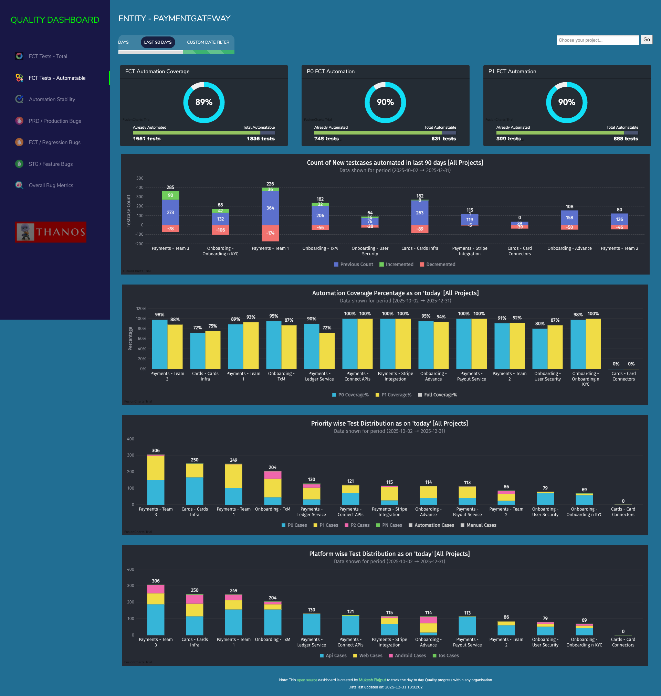
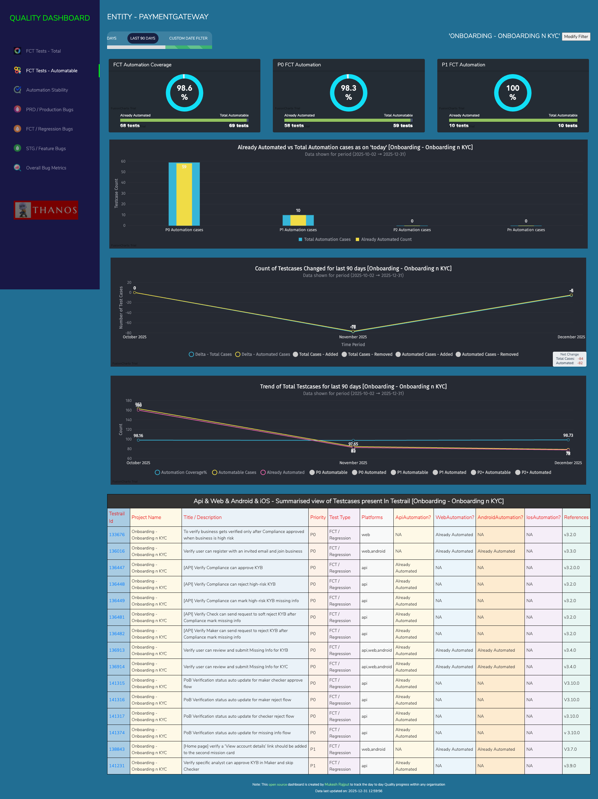
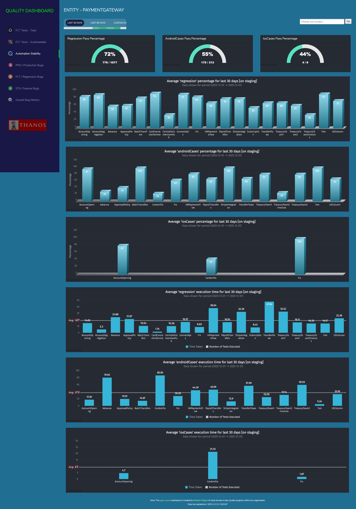
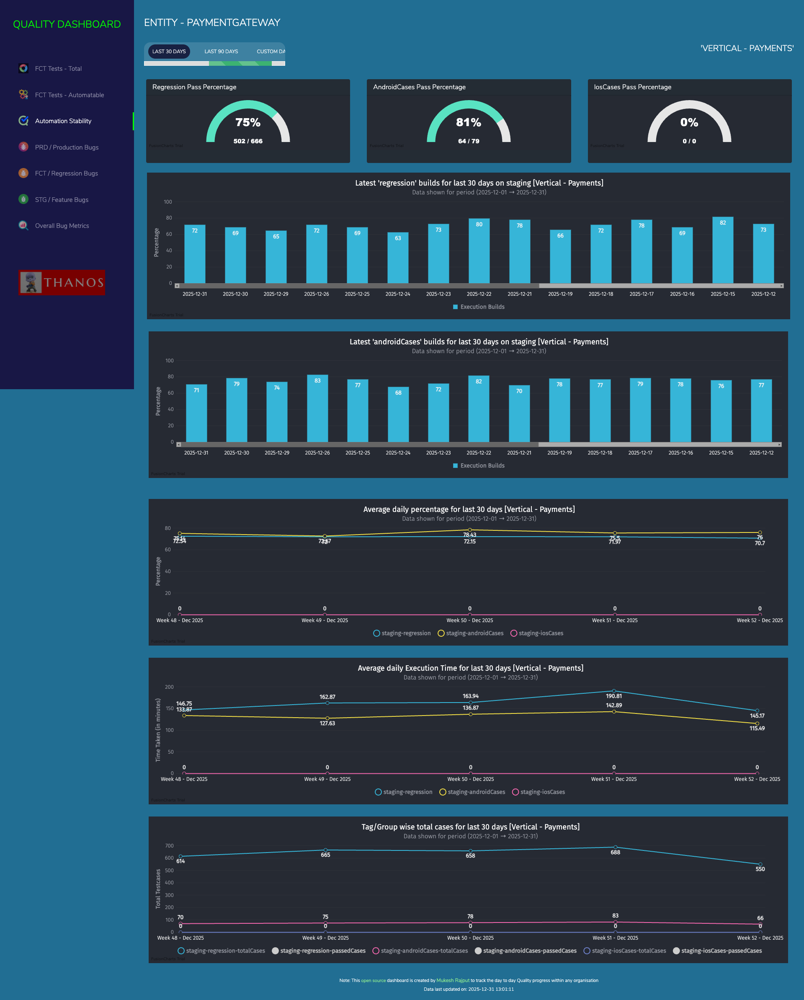
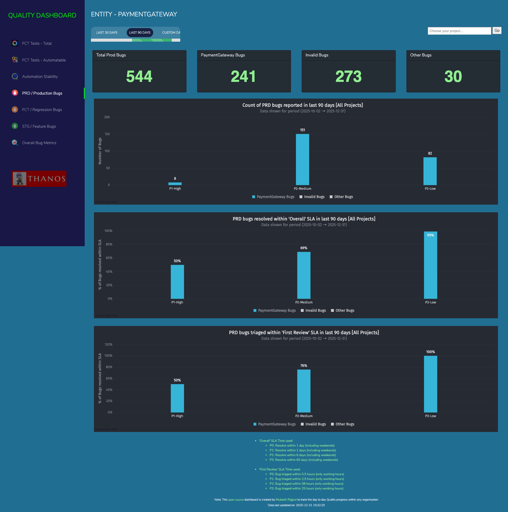
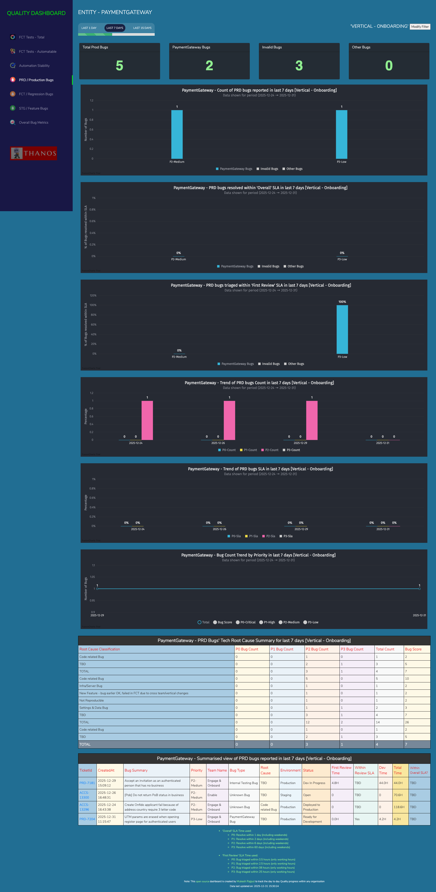
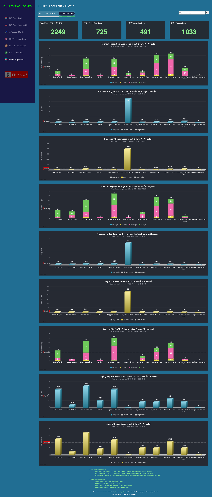
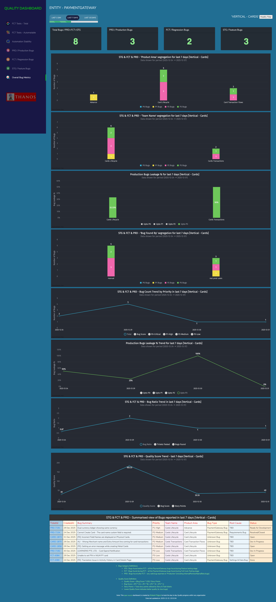

<div>
  

  # QUALITY DASHBOARD

  **📊 Overall Quality Metrics | Test Coverage Analytics | Bug Tracking Intelligence | Automation Stability Insights**
  
  [](https://www.php.net/)
  [](https://www.mysql.com/)
  [](https://www.oracle.com/java/)
  [](LICENSE)
</div>

An open-source quality metrics dashboard for tracking test coverage, automation stability, and bug metrics across multiple teams and projects. This dashboard helps organizations visualize quality metrics in real-time, making it easier to track quality progress across large engineering organizations.

## 📋 Table of Contents
- [Overview](#-overview)
- [Features](#-features)
- [Screenshots](#-screenshots)
- [Quick Start](#-quick-start)
- [Documentation](#-documentation)
- [Project Structure](#-project-structure)
- [Technologies](#-technologies)
- [License](#-license)
- [Creator](#-creator)
- [Acknowledgments](#-acknowledgments)

## 🎯 Overview
The Quality Dashboard is a comprehensive web-based solution for tracking quality metrics across your organization. It integrates with popular tools like TestRail, Jira, and automation frameworks to provide real-time insights into:

1. **FCT Coverage Metrics** - Total testcases, priority distribution (P0, P1, P2), automation coverage, platform distribution, and trend analysis
2. **Automation Stability** - Execution results, pass/fail rates, execution time trends, and stability metrics for each stream/project
3. **PRD Bug Metrics** - Production environment bug analysis, leakage tracking, and quality assurance metrics
4. **FCT Bug Metrics** - Feature Complete Testing bug tracking, regression analysis, and test coverage validation
5. **Staging Bug Metrics** - Staging environment bug monitoring, feature testing validation, and pre-production quality checks
6. **Overall Bug Analytics** - Comprehensive bug tracking across all environments, priority analysis, and trend charts

## ✨ Features
### Key Highlights
- **Custom Group Configurations**: Support for both 3-group and 4-group test configurations
- **Dynamic Project Filtering**: Filter by specific projects or view all verticals
- **Dynamic Date Filtering**: Time-based filters (1, 7, 15, 30, 90 days), custom date ranges, project-specific views
- **Platform-Specific Analysis**: Separate metrics for Web, API, Android, iOS platforms
- **Priority-Based Analysis**: P0, P1, P2 & P3 priority breakdown for tests and bugs
- **Dark/Light Mode**: Toggle between dark and light themes (default: Dark)
- **Vertical View**: High-level data view for larger teams/organizations
- **Almost Real-time Data**: Live data fetching from TestRail, Jira, and Automation frameworks

### Hidden Features
- **Dark & Light Mode View**: To enable or disable the darkmode use query param as `darkmode=1` (by default its `darkmode=1`). Example: `http://localhost:8282/bugs-prod.php?darkmode=1`
- **Vertical View**: In case your Group or Vertical is quite big then you can convert the dashboard to only show high-level data for bigger teams ie. verticals (1 vertical = 2 or more smaller teams). Use query param as `verticalview=1` (by default its `verticalview=0`). Example: `http://localhost:8282/bugs-prod.php?verticalview=1`

**Note:** All query params get stored in **cookies** (with 1 year expiration) so that you don't need to pass them in URL every time, this means make sure to use `darkmode=0` or `verticalview=0` to turn off these views accordingly.

## Dashboard Pages

### 1. *Test Coverage Pages*
- **tests-fct.php** - FCT Tests - Total: Complete test coverage metrics for Feature Complete Testing
- **tests-fct-auto.php** - FCT Tests - Automatable: Automation coverage analysis for FCT tests
- **tests-all.php** - Overall Tests - Total: Organization-wide test coverage metrics
- **tests-all-auto.php** - Overall Tests - Automatable: Organization-wide automation coverage analysis

### 2. *Automation Stability Page*
- **results.php** - Automation Stability: Test execution results, pass rates, and stability trends
- **Execution Time Analysis**: Performance metrics and execution time trends
- **Multi-Environment Support**: Separate tracking for different test environments

### 3. *Bug Metrics Pages*
- **bugs-total.php** - Overall Bug Metrics: Comprehensive bug tracking across all environments
- **bugs-prod.php** - PRD/Production Bugs: Production environment bug analysis
- **bugs-fct.php** - FCT/Regression Bugs: Feature Complete Testing bug metrics
- **bugs-staging.php** - STG/Feature Bugs: Staging environment bug tracking


### Documentation:
To know each and everything about this QA-Dashboard, refer to this [presentation document](Documentation/QA-Dashboard-ppt.pdf)

## Screenshots:

### FCT Test Coverage Data for all the Projects:


### FCT Test Coverage Data for a selected Project:


### Automation Stability Data for all the Projects:


### Automation Stability Data for a selected Project:


### Prod Bug Metrics Data for all the Projects:


### Prod Bug Metrics Data for a selected Project:


### Overall Bug Analytics Data for all the Projects:


### Overall Bug Analytics Data for a selected Project:


## 🚀 Quick Start

### Prerequisites
- **PHP Server**: (macOS usually has this installed)
- **MySQL Server**: For database management
- **Java**: For running data population scripts

### Installation

1. **Clone the repository**
   ```bash
   git clone https://github.com/yourusername/qa-dashboard.git
   cd qa-dashboard
   ```

2. **Setup Database**
   - Start your MySQL server.
   - Use [`Documentation/db-dump.sql`](Documentation/db-dump.sql) to create the database and insert dummy entries.
   - Default database name: `qa-dashboard`

3. **Configure Settings**
   - Update database credentials in [`Website/utils/constants.php`](Website/utils/constants.php).
   - *Note: Default credentials (root/empty) are for local dev only.*

4. **Run Server**
   ```bash
   cd Website
   php -S localhost:8282
   ```

5. **Access Dashboard**
   Open [http://localhost:8282](http://localhost:8282) in your browser.

## 📚 Documentation
For more detailed instructions, please refer to the following guides:

- **[🚀 Onboarding & Data Population](Documentation/ONBOARDING.md)**: How to add your organization and populate data from TestRail/Jira.
- **[ Presentation](Documentation/QA-Dashboard-ppt.pdf)**: Detailed slide deck about the dashboard.

## 📁 Project Structure

**Web Portal:**
- HTML, PHP, JavaScript
- MySQL
- Fusion Charts (Visualization)

**Data Populator:**
- Java
- TestNG, Gradle

```
qa-dashboard/
├── Website/                     # Web Portal Code
│   ├── index.php                # Entry point
│   ├── utils/                   # Config & Data Helpers
│   │   ├── config.php           # Entity Config
│   │   └── data/                # Data fetchers
│   ├── js/                      # JavaScript & Charts
│   └── css/                     # Styling
├── src/                         # Java Data Populator
│   └── test/java/thanos/        # Test classes & logic
├── Parameters/                  # Configuration Files
└── Documentation/               # Guides & SQL Dumps
```


## 🔧 Troubleshooting

### SQL Mode Error
If you see: `Error Code: 1055. Expression #2 of SELECT list is not in GROUP BY clause...`

**Solution:** Run this query in your MySQL client:
```sql
set global sql_mode='';
```
*Note: You may need to re-run this after MySQL server restarts.*

### Access Denied
If you see: `Error!: SQLSTATE[HY000] [1045] Access denied for user 'root'@'localhost'`

**Solution:** Update database credentials in [`Website/utils/constants.php`](Website/utils/constants.php):
- Set correct `DB_HOST_USERNAME` and `DB_HOST_PASSWORD` for your local MySQL

### Missing Data
If dashboard shows empty graphs or tables

**Solutions:**
- Ensure Data Populator scripts have run successfully
- Check `Parameters/config.properties` for correct API URLs
- Verify `lastUpdated` timestamp exists in database tables

---

## 📝 License

This project is open source. See [LICENSE](LICENSE) file for details.

---

## 👤 Creator

**Mukesh Rajput** For any further help or queries, contact [@mukesh.rajput](https://www.linkedin.com/in/mukesh-rajput/)

---

## 🙏 Acknowledgments

- **Fusion Charts**: For the excellent data visualization library.
- **Open Source Community**: For the tools and frameworks that make this possible.

---

<div align="center">
  <strong>Made with ❤️ for Engineering Team!</strong>
</div>