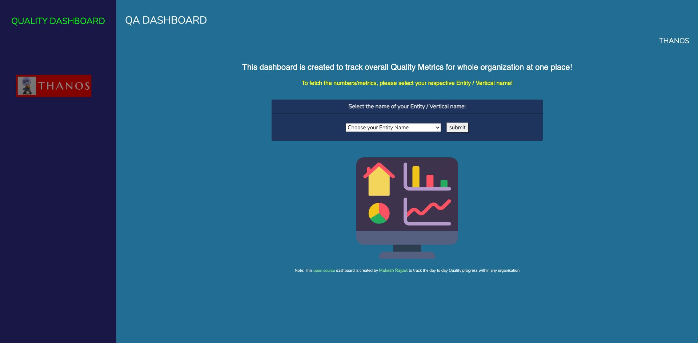
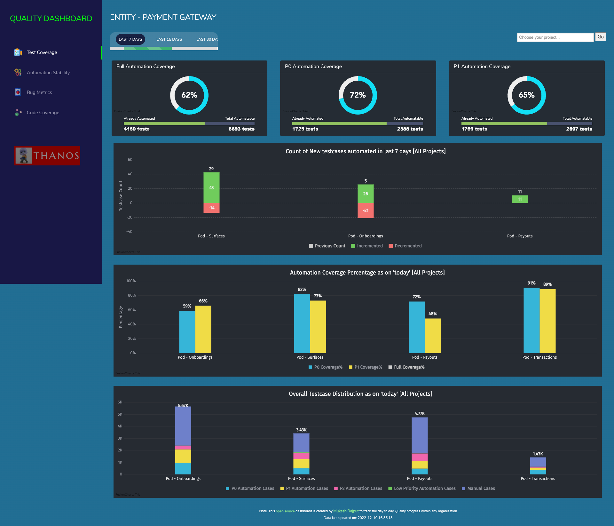
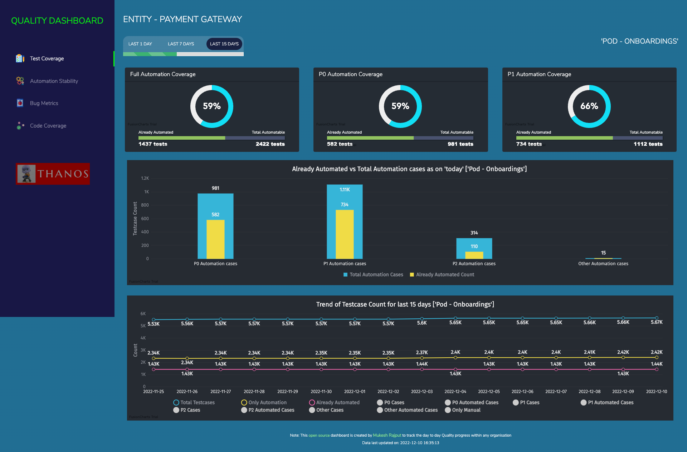
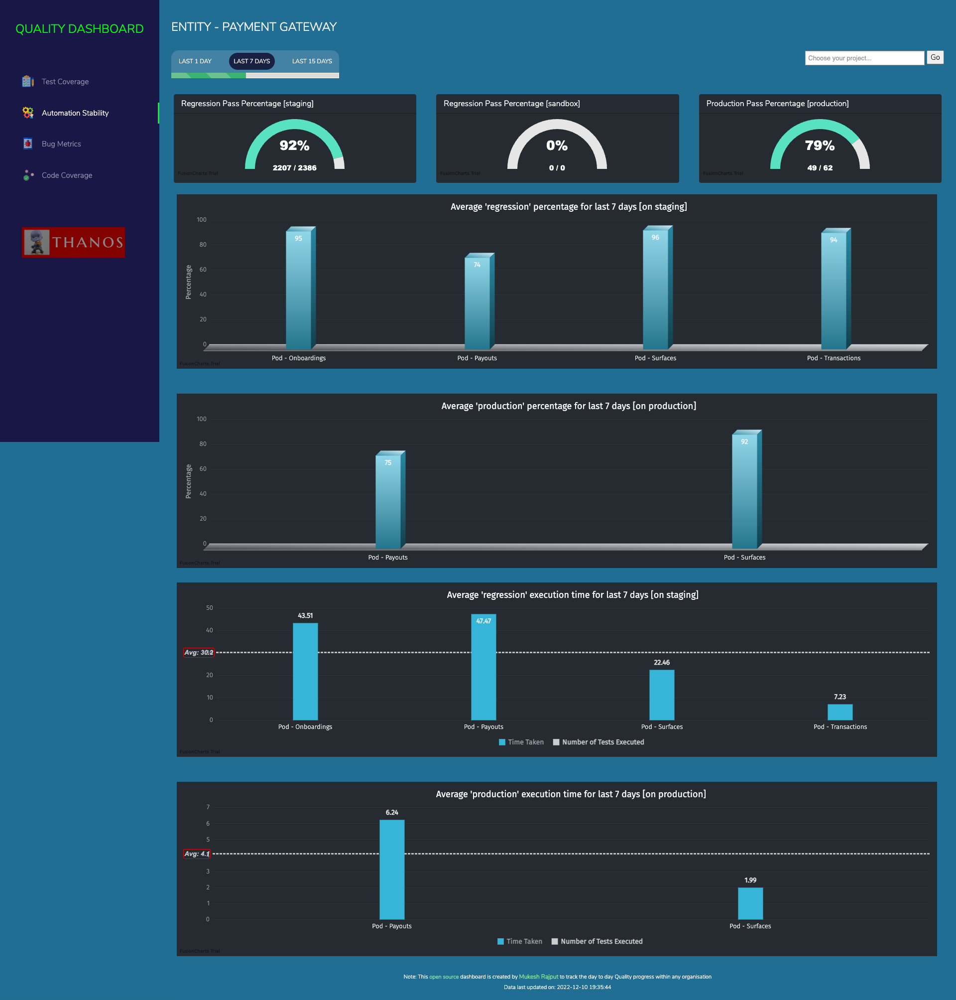
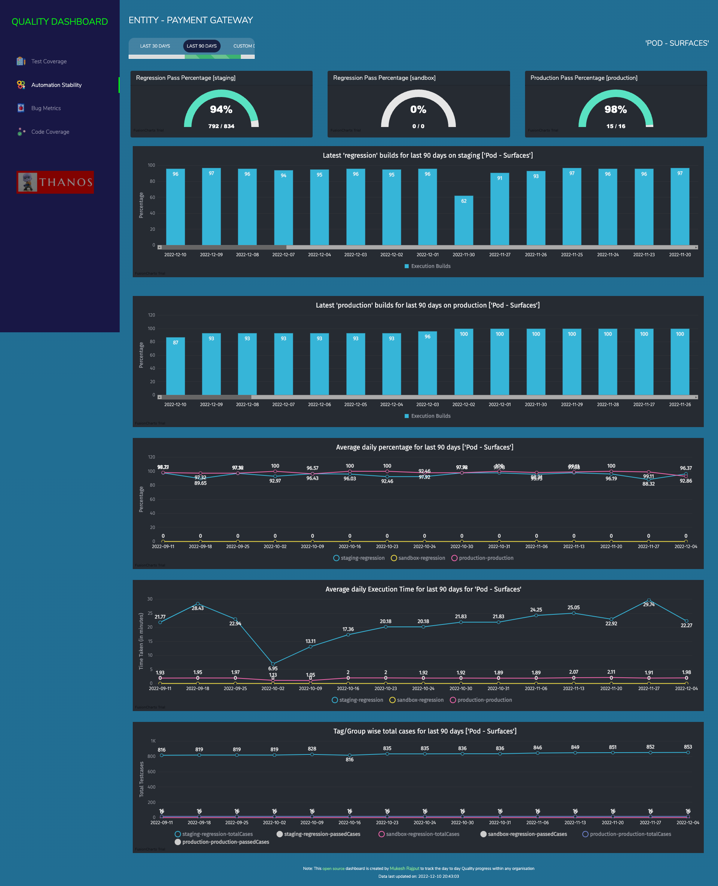
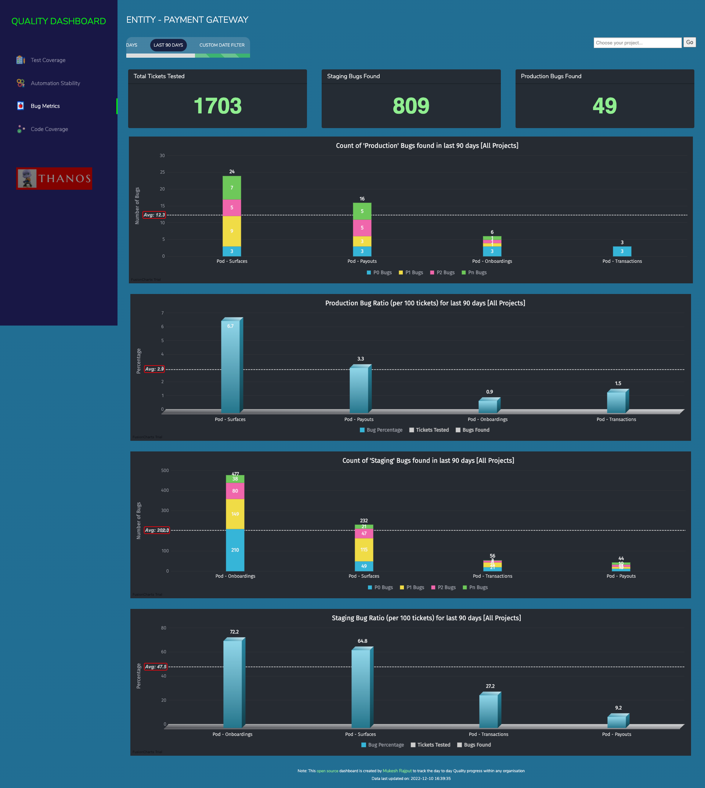
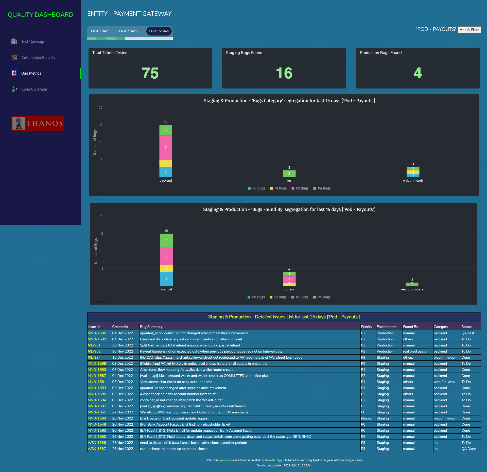
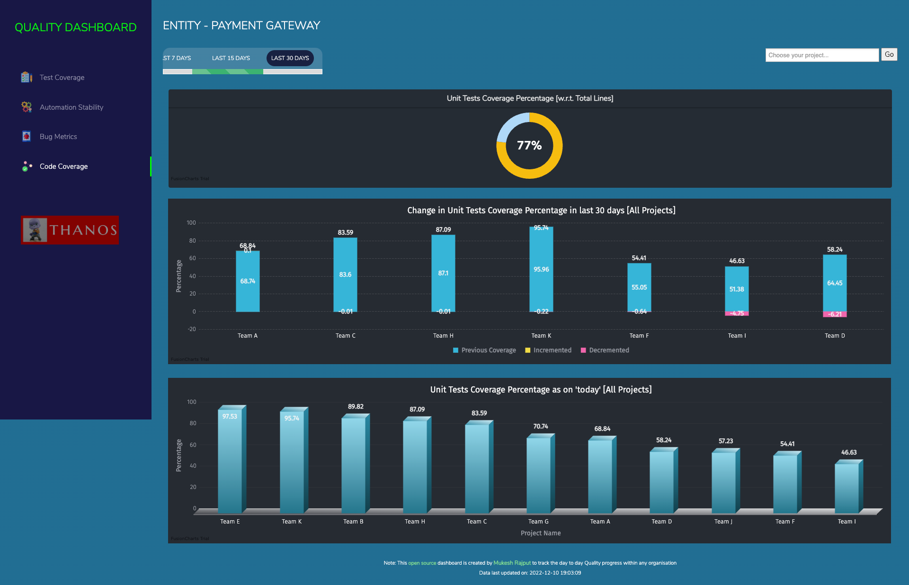
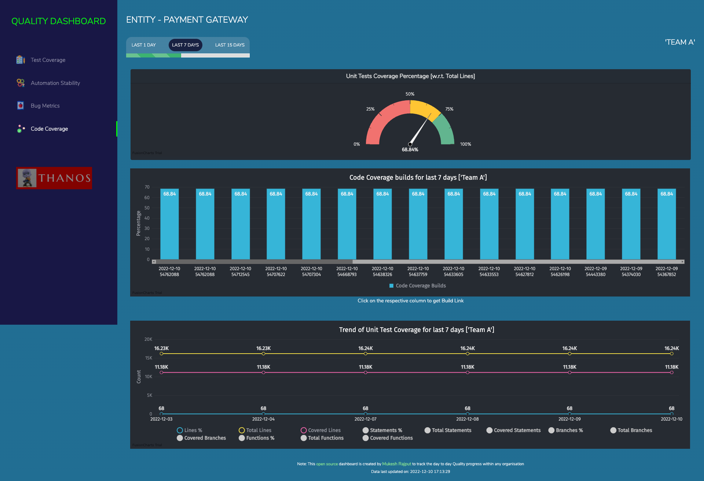

# QUALITY DASHBOARD
The purpose of creating this dashboard is to track the overall Quality Metrics of any product/service within any organization which has a lot of teams and so it's difficult to track each team manually.

### QA Dashboard can help to track:
1. Progress in terms of `Test Coverage` like how many total testcases we have, distribution in terms of priority like P0, P1, P2 etc, Automation coverage and many more

2. Progress report of `Automation Stability` and Execution time for each stream/project and other relevant trend charts around it

3. `Bugs Metrics` ie. data around total tickets tested, numbers of Bugs found in production or staging environment, what is their priority and other relevant trend charts around it

4. `Code Coverage` data is helpful to track the code coverage for developer's code via Unit Tests (written by devs). It supports not only Line Coverage but also Statement Coverage, Branch Coverage & Function Coverage (default is line coverage)


### Documentation:
##### To know each and everything about this QA-Dashboard, refer to this [presentation](Documentation/QA-Dashboard-ppt.pdf)
##### Detailed Video on how to [Install & Setup QA-Dashboard](https://youtu.be/peIV9eP-Gwg) in your local
##### Video covering detailed [Walkthrough of all the features](https://youtu.be/031XiHmKZQM) available in this QA-Dashboard

## Screenshots:

### Home Page of QA Dashboard:


### Test Coverage Data for all the Projects:


### Test Coverage Data for a selected Project:


### Automation Stability Data for all the Projects:


### Automation Stability Data for a selected Project:


### Bug Metrics Data for all the Projects:


### Bug Metrics Data for a selected Project:


### Code Coverage Data for all the Projects:


### Code Coverage Data for selected Project:



### Lets talk about some of the hidden features:
##### 1. Dark & Light Mode View:
To enable or disable the darkmode use query param as [`darkmode=1`](http://localhost:8282/testrail.php?darkmode=1) (by default its `darkmode=1`)
##### 2. Pod View for bigger teams:
In case your Group or Vertical is quite big then you can convert the dashboard to only show high-level data for bigger teams ie. pods (1 pod = 2 or more smaller teams). Use query param as [`podview=1`](http://localhost:8282/testrail.php?podview=1) (by default its `podview=0`)

**Note:** All query params get stored in **cookies** so that you don't need to pass them in URL every time, this means make sure to use `darkmode=1` or`podview=0` to turn off these views accordingly.


## Installation & Basic Setup:

#### 1. Install PHP Server in your machine
If its Mac, just use `brew install php`

#### 2. Install MYSQL Server
If its Mac, just use `brew install mysql`, and then start the server using: `mysql.server start`

#### 3. Clone this repo in your machine
After cloning the repo, navigate to the `Website/utils` folder and update database credentials in [constants.php file](Website/utils/constants.php "constants.php")

#### 4. Setup Dummy Database
Use [this basic db dump file](Documentation/db-dump.sql "db-dump.sql") to create database and insert few dummy entries, on the successful execution of this script you should get minimum 5 tables (`paymentGateway_results`, `paymentGateway_jira`, `paymentGateway_testrail`, `paymentGateway_bugs`, `paymentGateway_units`) along with configurations table created inside a database named as `thanos`

#### 5. Run queries to change createdAt of dummy data
```
set global sql_mode='';
Update payment_gateway_testrail set createdAt=DATE_ADD(createdAt, INTERVAL (Select DATEDIFF(now(),createdAt) from (Select createdAt from payment_gateway_testrail order by id desc limit 1) as X) DAY) where id > 0;
Update payment_gateway_results set createdAt=DATE_ADD(createdAt, INTERVAL (Select DATEDIFF(now(),createdAt) from (Select createdAt from payment_gateway_results order by id desc limit 1) as X) DAY) where id > 0;
Update payment_gateway_jira set createdAt=DATE_ADD(createdAt, INTERVAL (Select DATEDIFF(now(),createdAt) from (Select createdAt from payment_gateway_jira order by id desc limit 1) as X) DAY) where id > 0;
Update payment_gateway_bugs set createdAt=DATE_ADD(createdAt, INTERVAL (Select DATEDIFF(now(),createdAt) from (Select createdAt from payment_gateway_bugs order by id desc limit 1) as X) DAY) where id > 0;
Update payment_gateway_units set createdAt=DATE_ADD(createdAt, INTERVAL (Select DATEDIFF(now(),createdAt) from (Select createdAt from payment_gateway_units order by id desc limit 1) as X) DAY) where id > 0;
Update all_entities_testrail set createdAt=DATE_ADD(createdAt, INTERVAL (Select DATEDIFF(now(),createdAt) from (Select createdAt from all_entities_testrail order by id desc limit 1) as X) DAY) where id > 0;
Update all_entities_results set createdAt=DATE_ADD(createdAt, INTERVAL (Select DATEDIFF(now(),createdAt) from (Select createdAt from all_entities_results order by id desc limit 1) as X) DAY) where id > 0;
Update all_entities_jira set createdAt=DATE_ADD(createdAt, INTERVAL (Select DATEDIFF(now(),createdAt) from (Select createdAt from all_entities_jira order by id desc limit 1) as X) DAY) where id > 0;

```

#### 6. Start web server and you are DONE!
As final step, now navigate to `Website` folder via terminal and start the PHP server using cmd: `php -S localhost:8282`, then navigate to `http://localhost:8282`, you should see the home page as shown in the screenshots above. Congratulations basic setup using dummy data is done!


## Tech Stack Used:

#### For Web Portal:
##### HTML
##### CSS
##### JavaScript
##### PHP
##### MYSQL
##### FusionCharts

#### For Data Populator:
##### Java
##### TestNG
##### Gradle


## How I am populating data:
Incase you are also using Testrail & Jira in your organization then, please refer to `src` folder in the root directory, it contains whole framework for populating data into these tables, but if your are not using Testrail or Jira then you need to build your own utility to fetch data from them.

1. For `paymentGateway_results table` - I have updated my automation frameworks to insert required data in `_results` table at the end of each automation execution.

2. For `paymentGateway_testrail table` - Please don't be confused with the table name, it is not only limited to testrail numbers, but these numbers can also be fetched from any testcase management tool. I have used APIs of Testrail to fetch all the required numbers from Testrail and then inserting them in the `_testrail` table twice a day.

3. For `paymentGateway_jira` & `paymentGateway_bugs table`- Again don't be confused with the table names, these are not only limited to Jira numbers, but these numbers can also be fetched from any ticket management tool. I have used APIs of Jira to fetch all the required numbers from Jira and then inserting them in the `_jira & _bugs` table twice a day.

4. For `paymentGateway_units table` - This table is used to store the code coverage data sent by developer's pipeline into GCP bucket and from ther our worker read csv files and populate data into `_units` table every day.

Point is, no matter if you insert data manually or via automation scripts, till the time you are able to add data in these 5 tables daily/weekly, your dashboard will keep showing updated datapoints.


## Steps for onboarding your Organization to QA Dashboard:
1. Rename the test class file: [PaymentGatewayNumbers.java](src/test/java/thanos/PaymentGatewayNumbers.java "PaymentGatewayNumbers.java") at path `src/test/java/thanos/` with your EntityName.
2. Update `entityName` variable as per your Entity Name in test class file.
3. Rename directory inside `Parameters/` path with `EntityName`
4. After this, using mySql workbench, truncate all the tables present in Thanos DB to remove dummy data except `configurations` from table.
5. Now, Rename all the table names, to replace prefix from `payment_gateway` to your `entity_name`
6. Once this is done, replace `Payment Gateway` related data points with your `Entity Name` in `configurations` table and accordingly disable/enable the respective pages in case all the integrations are not required.
7. Now, follow these steps for each type of integration you want to have: 
    
    ### For Test Coverage:
    ##### Prerequisite: You must have a TestRail Account
    1. Check test method `fetchTestCoverageData` in your test class ie. [PaymentGatewayNumbers.java](src/test/java/thanos/PaymentGatewayNumbers.java "PaymentGatewayNumbers.java") and update the description to remove Payment Gateway
    2. Inside directory `Parameters/<Entity Name>`, In [TestRailConfig.json](Parameters/PaymentGateway/TestRailConfig.json "TestRailConfig.json"), list out all the TestRail suite names(name can be anything which you want to show in QA-Dashboard) of your Entity along with suite id and project id in the existing format.
    3. Finally, put TestRail Credentials in the [config.properties file](Parameters/config.properties "config.properties")
    
    ### For Bug Metrics:
    ##### Prerequisite: You must have a Jira Admin Account
    1. Check test method `fetchBugMetricsData` in your test class ie. [PaymentGatewayNumbers.java](src/test/java/thanos/PaymentGatewayNumbers.java "PaymentGatewayNumbers.java") and update the description to remove Payment Gateway
    2. Update the logic of filters in the code, like from which date you want to fetch numbers, what all Jira issue types you want to capture along with different statuses for "tickets tested" & "bugs found" data.
    3. Then create, custom fields in Jira (you will require Admin access of Jira for this) so that people can start filling various data points against every bug found like - environment (staging/production), bugFoundBy (manual/automation/crashes/actual users etc) and bugCategory (android/ios/backend/web/mweb etc) and attach these new fields in Jira bug screen.
    4. Now, put custom field IDs of these new fields in the method `fetchBugMetricsData`
    5. Inside directory `Parameters/<Entity Name>`, In[JiraConfig.json](Parameters/PaymentGateway/JiraConfig.json "JiraConfig.json"), list out all the Jira project names (name can be anything which you want to show in QA-Dashboard) of your Entity along with Jira project key in the existing format.
    6. Finally, put Jira Credentials in the [config.properties file](Parameters/config.properties "config.properties")
    
    ### For Automation Results:
    ##### Prerequisite: You must have a GCP bucket and secret key file to access the bucket and working Automation frameworks
    1. One way is to directly insert data into the thanos DB after each automation execution (write your own custom code for this) then you dont need to follow setp 2 & 3 listed below.
    2. Another way is to create the jar file of this repo & put in your automation framework repo as a dependency.
    3. Thereafter call this function `ResultsHelper.createAutomationResultsCsvAndUploadToGcpBucket` and pass all the necessary parameters, this will help to put your automation results data in GCP bucket in the form of csv file.
    4. Then in this (QA Dashboard) repo, In [AutomationConfig.json](Parameters/PaymentGateway/AutomationConfig.json "AutomationConfig.json") list out all the automation project names (name should match with name you sending in csv file) of your Entity along with Platform type in the existing format.
    5. Now, Inside test method `fetchAutomationStabilityData` in the test class [PaymentGatewayNumbers.java](src/test/java/thanos/PaymentGatewayNumbers.java "PaymentGatewayNumbers.java") and update the description to remove Payment Gateway and have proper csv `fileNamePrefix` accordingly.
    6. Finally, Put the secret key file of Bucket inside parameters or some other place and update the pass in `gcpBucketAuthKeyLocation` variable

    ### For Unit Tests Coverage:
    ##### Prerequisite: You must have a GCP bucket and secret key file to access the bucket and working Code coverage tool inside Developer's repo
    1. Unit test coverage data is generated using the developer's pipeline, if this data in not available then ask developers to have code coverage framework for each repo.
    2. Developer's Repo will upload data to GCP bucket (as csv file) by doing 1 time integration with GCP bucket(using ci/cd pipelines). File format and sample code [can be found here](https://docs.google.com/spreadsheets/d/1SjmPT591qUQzld6syw8jynKNDixrwdXdjcyD7TvjdBw/edit#gid=120821750). For this ask them to write their custom code in each repository.
    3. Now, Inside test method `fetchCodeCoverageData` in the test class [PaymentGatewayNumbers.java](src/test/java/thanos/PaymentGatewayNumbers.java "PaymentGatewayNumbers.java") and update the description to remove Payment Gateway and have proper csv `fileNamePrefix` accordingly.
    4. Finally, Put the secret key file of Bucket inside parameters or some other place and update the pass in `gcpBucketAuthKeyLocation` variable

8. Once all the steps are done, data will start populating into respective DB tables and you can schedule to run this code everyday or multiple times a day as per requirements. 


## Debugging:
1. In case your mysql server is not able to execute some of the queries and showing error something like: 
`Error Code: 1055. Expression #2 of SELECT list is not in GROUP BY clause and contains nonaggregated column 'thanos.a.totalTicketsTested' which is not functionally dependent on columns in GROUP BY clause; this is incompatible with sql_mode=only_full_group_by`.<br>
Then run this query in the mysql terminal or UI: `set global sql_mode='';` and start the sql connection again, please remember that if you restart the mysql server or your laptop then you might need to execute this cmd again.

2. If you are seeing `Error!: SQLSTATE[HY000] [1045] Access denied for user 'root'@'localhost' (using password: NO)` on the dashboard it means your db credentials are incorrect, you need to modify them in [this file](Website/utils/constants.php "constants.php")

In case there are some more bugs/issues, you can report them to the [Issues](https://github.com/msr5464/QA-Dashboard/issues) section of this repo.


## Want to Contribute?
As code is already publicly available, for contributing further just raise a Pull Request after making the necessary changes. Once PR is all reviewed it will be merged into master and your change will be live. Just fyi, code related to Frontend is placed in “Website” folder and Code related to Backend (ie. Data Polulators) is in “src” folder.


## Creator:
Mukesh Rajput, For any further help or queries, contact [@mukesh.rajput](https://www.linkedin.com/in/mukesh-rajput)