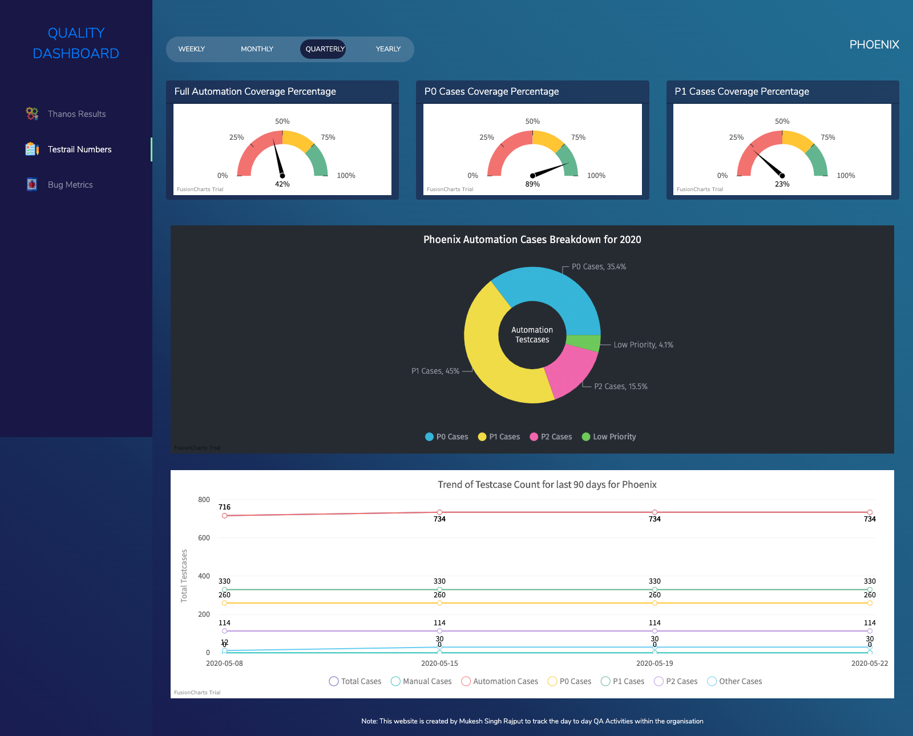
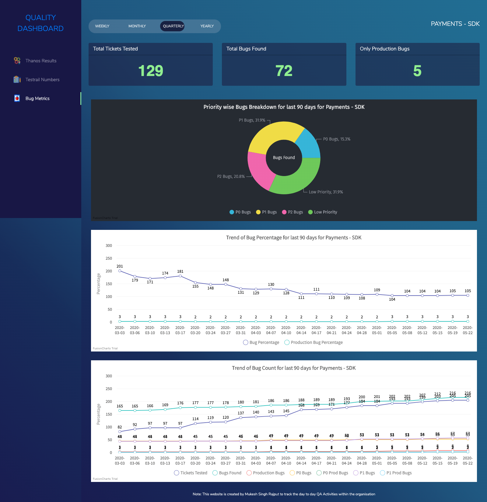

# QA Dashboard
To Start Web Server: `php -S localhost:8282`

# Screenshots

### Home Page of QA Dashboard:

### Automation Result Numbers for all the Projects:

### Automation Result Numbers for One Project:

### Testrail Numbers Page for all the Projects:

### Testrail Numbers Page for one Project:

### Bug Metrics Page for all the Projects:

### Bug Metrics Page for one Project:

#### References:
This dashboard has been creating by using public services of [Fusion Charts](https://www.fusioncharts.com/).
A big Thanks to Fusion Charts team for putting such a wonderful documentation which helped me in swift integration.